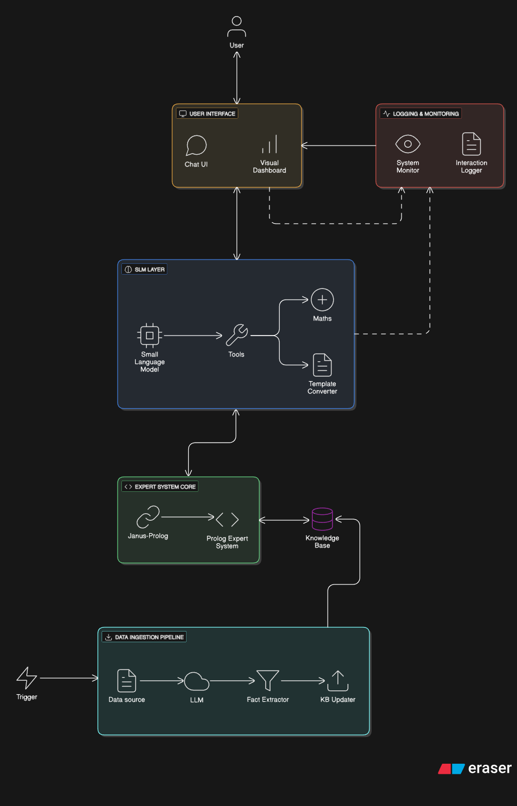

# neuro-symbolic-pc-builder

Expert pc builder using Small Language Models as the neuro part and Expert System as the symbolic part

## Architecture Overview

The architecture of the neuro-symbolic PC builder consists of following components:

1. **Neuro Component**: This component utilizes Small Language Models (SLMs) to interpret user requirements and preferences for building a PC. The SLM processes natural language inputs and extracts relevant information such as budget, performance needs, and specific hardware preferences to formulate queries for the symbolic component.

2. **Symbolic Component**: This component is an Expert System that uses a Prolog-based knowledge base to reason about PC components and configurations. It applies logical rules and constraints to generate optimal PC build recommendations based on the inputs provided by the neuro component.

3. **Knowledge Base**: The knowledge base contains detailed information about various PC components, including specifications, compatibility rules, and pricing. This data is structured in a way that allows the symbolic component to efficiently query and reason about possible configurations.

4. **Data Ingestion Component**: This component is responsible for collecting and updating the knowledge base with the latest information about PC components. It may scrape data from online retailers, manufacturers, and review sites to ensure that the knowledge base remains current and accurate.

5. **Logging and Monitoring Component**: This component tracks the system's performance, logs user interactions, and monitors the health of the neuro and symbolic components to ensure reliability and facilitate debugging.

## Architecture Diagram



## Setup Instructions

1. **Install poetry**: If you don't have Poetry installed, you can do so by following the instructions at [https://python-poetry.org/docs/#installation](https://python-poetry.org/docs/#installation).

2. **Clone the repository**: Clone this repository to your local machine.

3. **Navigate to the project directory**: Open your terminal and navigate to the root directory of the cloned repository.

4. **Install dependencies**: Run the following command to install all required dependencies using Poetry:

    ```bash
    poetry install
    ```

## Check Janus-Prolog Integration

To verify that the Janus-Prolog integration is functioning correctly, follow these steps:

1. Ensure all prerequisites are installed, including SWI-Prolog and the `janus_swi` Python package.

2. Set the necessary environment variables for SWI-Prolog:

   - `SWI_HOME_DIR`: Path to the SWI-Prolog installation directory.
   - Update the `PATH` environment variable to include the SWI-Prolog `bin` directory.

    > Restart the IDE or terminal after setting the environment variables to ensure they take effect.

3. Run the following command from root directory to test the integration:

    ```bash
    poetry run python src/logic/janus_check.py
    ```

4. If the integration is successful, you should see output similar to:

    ```plain
    Loading Knowledge Base via Janus...
    🔎 Querying builds under $800 (using modern Janus bridge)...
    Found Build: CPU=i5_13600k, Mobo=z790_aorus, Total=$550
    Found Build: CPU=ryzen_7800x3d, Mobo=b650_tomahawk, Total=$650
    ```

## Agent Usage

Run the following command from root directory to test the agent functionality:

  ```bash
  poetry run python -m src.agents.agent
  ```

## Troubleshooting

- `SWI-Prolog: [FATAL ERROR: at Sun Nov 23 03:31:34 2025 Could not find system resources]`  
  Make sure to set the `SWI_HOME_DIR` and update the `PATH` environment variable to include the SWI-Prolog installation directory before importing the `janus_swi` module.

    Example for Windows (adjust the path as necessary):

    ```python
    import os
    os.environ["SWI_HOME_DIR"] = "C:\\Program Files\\swipl"
    os.environ["PATH"] += os.pathsep + "C:\\Program Files\\swipl\\bin"
    import janus_swi as janus
    ```

    Or set these environment variables (`SWI_HOME_DIR` and `PATH`) in your system settings.

    > Restart the IDE or terminal after setting the environment variables to ensure they take effect.

- `JanusError: Prolog error: existence_error(source_sink, 'knowledge_base.pl')`  
  Ensure that the Prolog knowledge base file `knowledge_base.pl` is located in the correct directory relative to where the script is being run. Adjust the path in the `janus.consult()` call if necessary.

    For example, if the file is in a subdirectory named `knowledge`, use:

    ```python
    janus.consult("knowledge/knowledge_base.pl")
    ```
